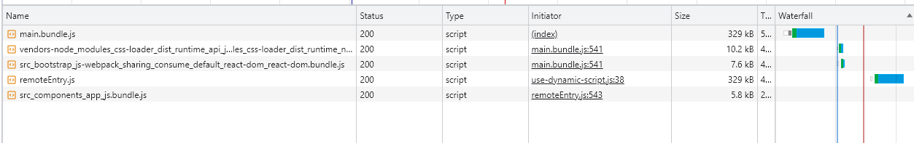
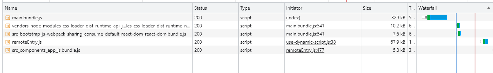

## Структура документа

### Оглавление

- [Module Federation](#Module-Federation)
- [Статическая конфигурация](#Статическая-конфигурация)
- [Динамическая конфигурация](#Динамическая-конфигурация)
- [Общие зависимости](#Общие-зависимости)
- [Несколько важных деталей](#Несколько-важных-деталей)

### Module Federation

[`Module Federation`](https://webpack.js.org/concepts/module-federation/) - это built-in плагин системы сборки `webpack`, позволяющий одному `webpack`-приложению динамически подгружать код из другого `webpack`-приложения в `runtime`. То есть любой модуль, сборку которого поддерживает webpack, можно подключить через `Module Federation`: стили, изображения, шрифты и вообще любые модули, которые собирает `webpack`.

### Статическая конфигурация

Основная конфигурация происходит на уровне сборки: задается имя приложения, список подключаемых модулей (для статических удаленных модулей), управление зависимостями и т.д. В случае со статическим адресом всё просто: указываем название и адрес удаленного модуля, а хостовое приложение забирает его по указанному адресу.

Базовый пример настройки удаленного (`remote`) приложения:

```js
new ModuleFederationPlugin({
  name: "remoteApp",
  filename: "remoteEntry.js",
  exposes: {
    "./RemoteApplication": "./src/index.tsx",
  },
  shared: {
    ...deps,
    react: {
      singleton: true,
    },
    "react-dom": {
      singleton: true,
    },
  },
});
```

В этой конфигурации мы указываем, какие модули (или его части) доступны для импорта в хостовое приложение. Для более детального изучения настроек и нюансов работы стоит обратиться к официальной документации.

Настройка же основного (`host`) приложения может иметь следующий вид:

```js
new ModuleFederationPlugin({
  name: "hostApp",
  remotes: {
    remoteApp: "remoteApp@http://localhost:8081/remoteEntry.js",
  },
  shared: {
    ...deps,
    react: {
      eager: true,
      singleton: true,
    },
    "react-dom": {
      eager: true,
      singleton: true,
    },
  },
});
```

Здесь мы указываем адрес, по которому доступно приложение, конфигурируем зависимости (`Module Federation` может шарить между собой общие зависимости, если совпадает их версия. Например, если `React` уже загружен, то он не будет повторно грузиться со стороннего webpack-приложения).

Далее в коде основного приложения достаточно импортировать приложение, которое хотите встроить:

```js
const RemoteComponent = React.lazy(() => import("remoteApp/RemoteApplication"));
```

### Динамическая конфигурация

Когда мы рассматриваем микрофронтовые приложения как аналог системы плагинов, причем что загружать, а что нет - определяет runtime-конфигурация, или в случае, если адрес загрузки удалённого модуля по каким-то причинам меняется, то модуль загружается иначе. Здесь стоит внимательнее изучить то, каким образом `webpack` собирает свои модули, а именно работу с `modules scope` (массив `__webpack_exports__`).
Согласно [официальной документации](https://webpack.js.org/concepts/module-federation/#promise-based-dynamic-remotes) необходимо описать тело скрипта в виде строки, положив все это в `promise`.

У приведенного способа имеется несколько проблем:

- редактировать скрипт в виде строки неудобно
- если модулей несколько, то для каждого модуля необходимо вставлять текст со своим скриптом
- невозможно прокидывать параметры для динамического адреса, кроме доступных через объект window

Поэтому для реализации динамического построения приложения был выбран следующи подход:

- на основании имени модуля, скоупа и адреса динамически производится встраивание соответствующего скрипта
- далее происходит загрузка модуля уже известным способом: `  const Component = React.lazy(loadComponent(scope, module));`

Тонкость здесь кроется в реализации функции `loadComponent`. Она заключается в использовании контейнера `webpack`, который поддерживает методы `get` и `init` и работает с shared-скоупом модулей.

```js
export const loadComponent = (scope, module) => {
  return async () => {
    // Initializes the share scope. This fills it with known provided modules from this build and all remotes
    await __webpack_init_sharing__("default");
    const container = window[scope]; // or get the container somewhere else
    // Initialize the container, it may provide shared modules
    await container.init(__webpack_share_scopes__.default);
    const factory = await window[scope].get(module);
    const Module = factory();
    return Module;
  };
};
```

### Общие зависимости

Параметр `shared` в настройках `module federation` позволяет совместно использовать модули между разными приложениями во избежании дублирования кода и уменьшить размер бандлов.

Ниже представлен пример скриншота, когда подтягиваются одни и те же зависимости. Модуль `remoteEntry.js` подтягивает те же библиотеки, что имеются в хостовом приложении:

.

В случае же совместного использования модулей размер `remoteEntry.js` заметно сокращается:
.

В представленной выше конфигурации в `shared` параметре модули `react` и `react-dom` содержат параметр `singleton: true`, что означает, что только одна копия модуля будет использоваться между приложениями.

При сборке приложения `webpack` будет искать модули сначала в локальных зависимостях, а затем в общих модулях, которые определены в списке `shared` для каждого приложения.

Список некоторых поддерживаемых дополнительных параметров:

- `singleton` - если установлено значение `true`, то общий модуль будет загружаться только один раз, даже если он используется в нескольких приложениях
- `requiredVersion` - определение минимальной загружаемой версии общего модуля
- `import` - можно использовать для указания пути к общему модулю, если он не является глобальной переменной
- `eager` - если установлено значение `true`, то общий модуль будет загружен сразу при инициализации приложения, а не по требованию
- `strictVersion` - если установлено значение `true`, то при загрузке общего модуля будет проверяться его версия, и если она не соответствует требуемой, то загрузка завершится ошибкой
- `packageName` - позволяет задать имя пакета для поиска требуемой версии

### Несколько важных деталей

- каждый модуль (приложение) может являться независимым, работающим самостоятельно модулем без каких-либо внешних зависимостей. Соответственно, приложения могут быть развёрнуты на разных доменах и деплоиться независимо друг от друга и иметь различный жизненный цикл
- `webpack` в `runtime` не собирает встраиваемые модули, а "подключает" уже ранее собранные части приложения. То есть, для того, чтобы встроить микрофронт, это приложение должно быть собрано. Далее указывается путь, на котором или работает приложение (`http://application.com/remoteEntry.js`), или лежит готовая сборка (например, в приватном npm-репозитории и т.д.).
- нет необходимости пересобирать основное приложение, если поменялся shared-модуль
